# Loket Tiket (Tubes Semester 1)

### Deskripsi dan Spesifikasi Program

Program ini merupakan aplikasi sederhana untuk manajemen loket untuk pemesanan tiket kapal. Berikut adalah deskripsi dan spesifikasi program:

#### 1. Array dan Struktur Data

-  **Array Kapal (`kapal.c` dan `kapal.h`):**
- Digunakan untuk menyimpan data kapal, termasuk ID, nama kapal, rute, tanggal keberangkatan, kapasitas, dan harga.
- Ukuran array kapal memiliki nilai maksimal `4`.
- Terdapat fungsi-fungsi untuk mencari kapal berdasarkan ID (`cariKapal`), menampilkan tabel kapal (`printTabelKapal`), menambah kapal baru (`tambahKapal`).

-  **Array Tiket (`tiket.c` dan `tiket.h`):**
- Digunakan untuk menyimpan data tiket, termasuk nama pembeli, dan ID kapal terkait.
- Ukuran array tiket dinamis.
- Terdapat fungsi-fungsi untuk inisialisasi dummy tiket (`initDummyTiket`), menampilkan tabel tiket dengan informasi kapal (`printTabelTiket`), membeli tiket (`tambahTiket`), mengurutkan data tiket berdasarkan nama pembeli (`sortTiket`), dan memberangkatkan kapal (`departKapal`).

#### 2. User Manual

##### Langkah-langkah Penggunaan Program:

1.  **Kompilasi Program:**

- Gunakan perintah berikut untuk mengompilasi program:
```bash
gcc -o tubes main.c kapal.c tiket.c
```

2.  **Menjalankan Program:**

- Setelah berhasil dikompilasi, jalankan program dengan perintah:
```bash
./tubes
```

3.  **Menu Utama:**

- Program akan menampilkan menu utama dengan pilihan operasi berikut:
```
1. Lihat data kapal
2. Lihat data tiket
3. Tambahkan kapal
4. Beli tiket
5. Berangkatkan kapal
6. Urutkan data tiket berdasarkan nama
0. Keluar
```

4.  **Memilih Menu:**

- Pilih angka sesuai dengan operasi yang diinginkan dan tekan Enter.

5.  **Lihat Data Kapal / Tiket:**

- Pilih opsi 1 atau 2 untuk melihat data kapal atau tiket.

6.  **Tambahkan Kapal:**

- Pilih opsi 3 untuk menambahkan kapal baru. Ikuti petunjuk yang muncul di layar.

7.  **Beli tiket:**

- Pilih opsi 4 untuk membuat tiket baru. Ikuti petunjuk untuk mengisi informasi tiket.

8.  **Berangkatkan Kapal:**

- Pilih opsi 5 untuk memberangkatkan kapal. Pilih kapal yang ingin diberangkatkan dan konfirmasi.

9.  **Urutkan Data Tiket:**

- Pilih opsi 6 untuk mengurutkan data tiket berdasarkan nama pembeli.

10.  **Keluar:**

- Pilih opsi 0 untuk keluar dari program.

11.  **Selesai:**

- Program akan berhenti dan menampilkan pesan terima kasih.

#### 3. Screenshot code

- Code tiket.c

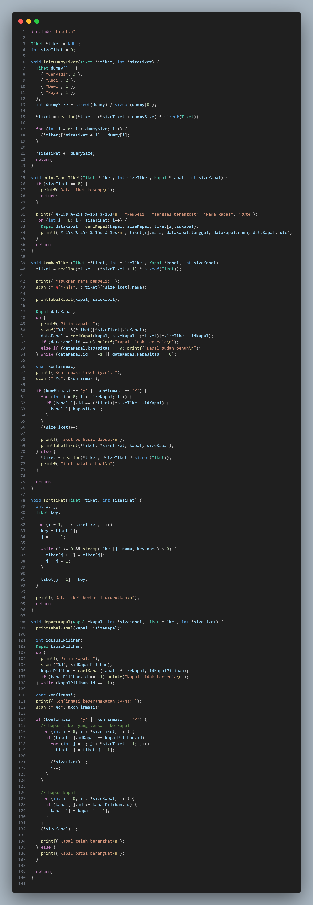

- Code tiket.h

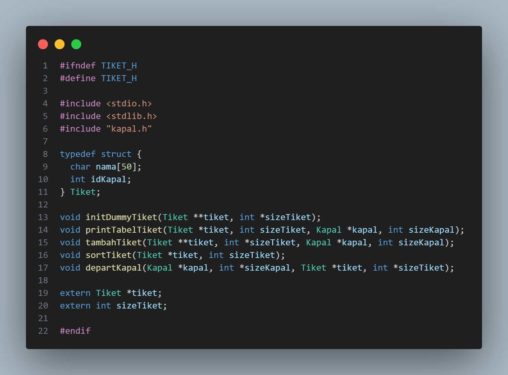

- Code kapal.c

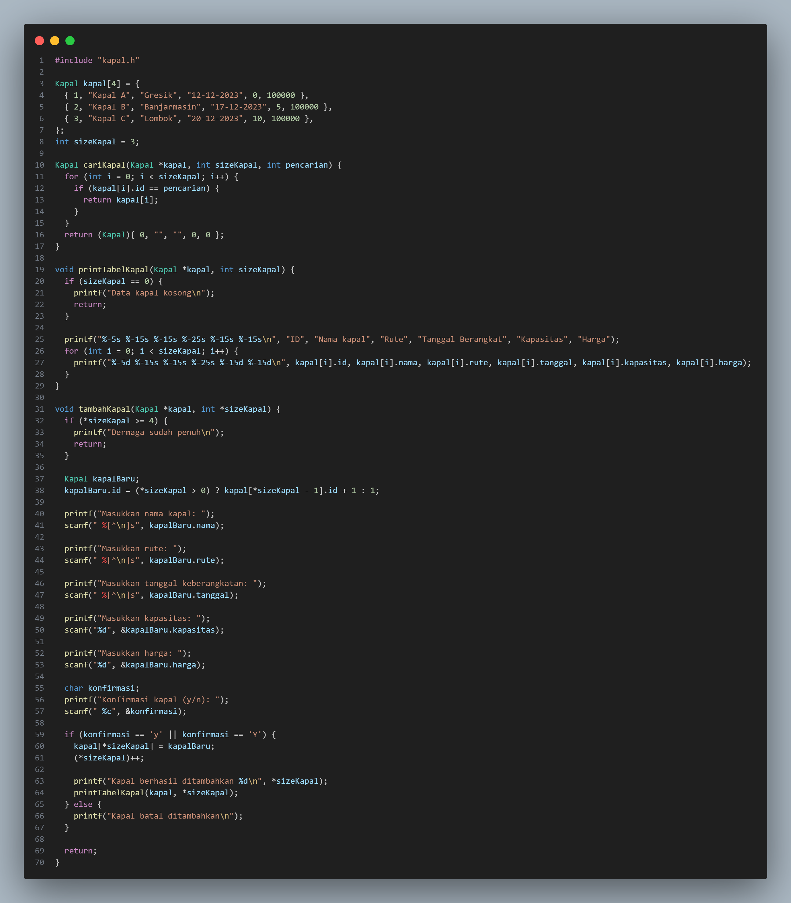

- Code kapal.h

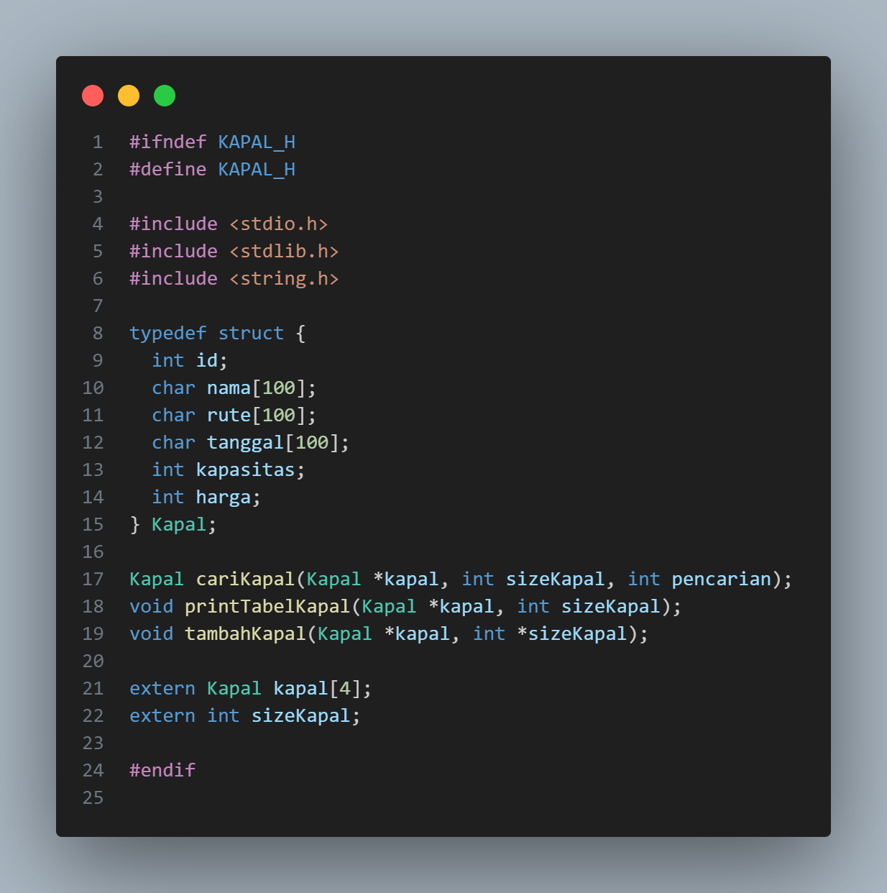

- Code main.c

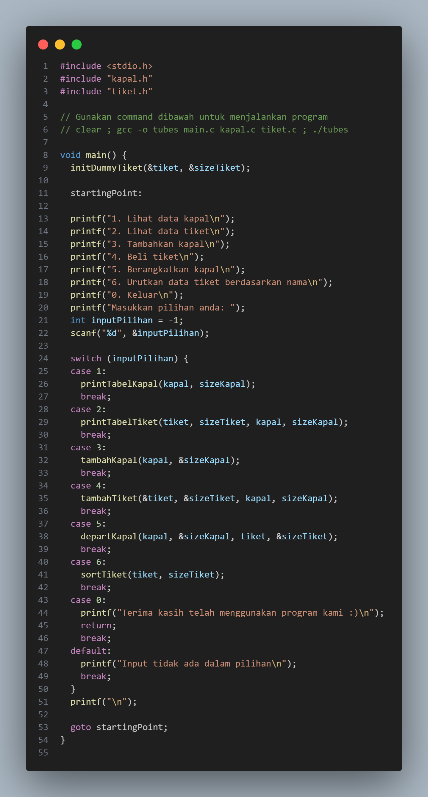

#### 4. Screenshot program

- Lihat kapal

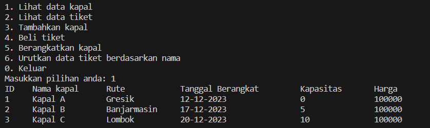

- Lihat tiket

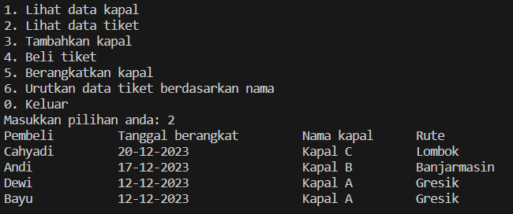

- Tambah kapal

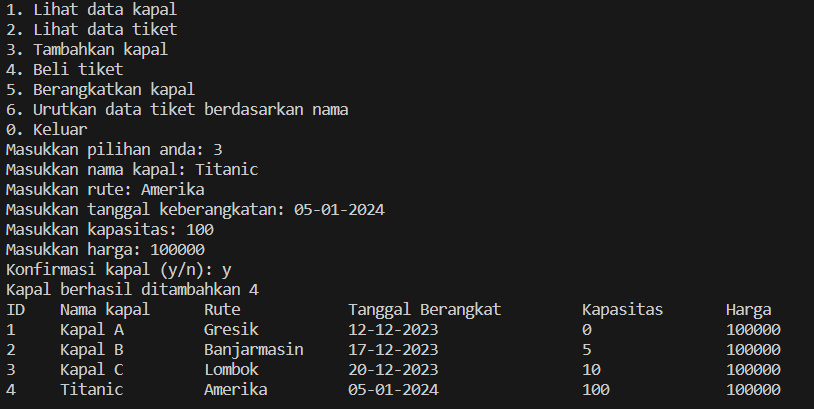

- Beli tiket

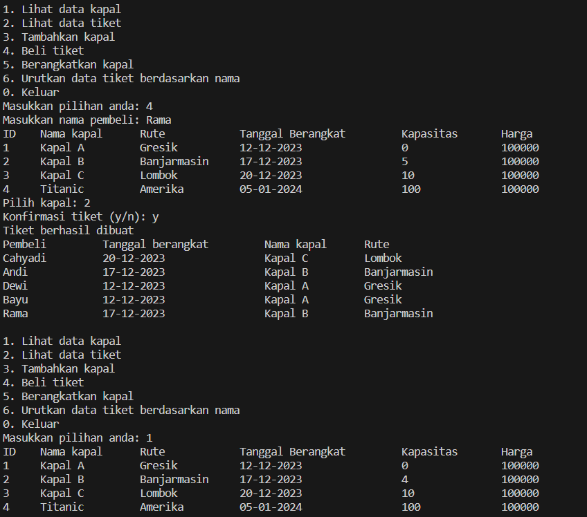

- Berangkatkan kapal

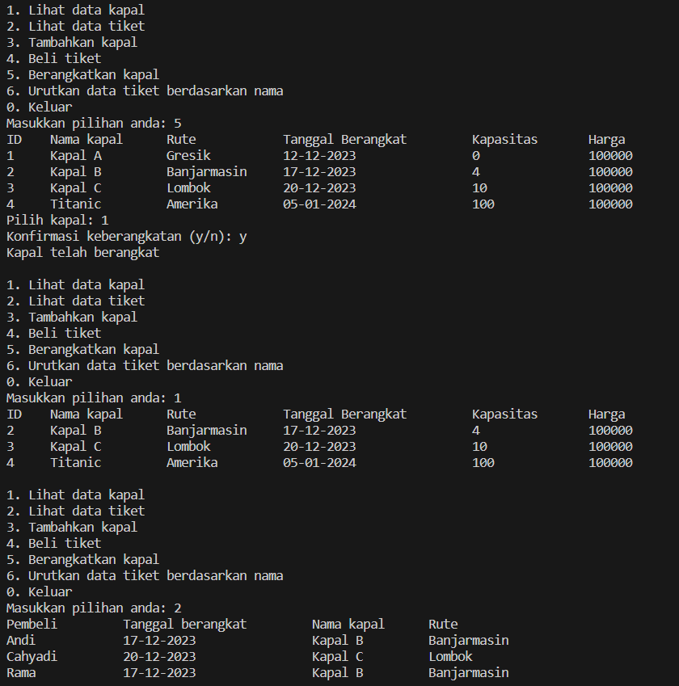

- Sort tiket

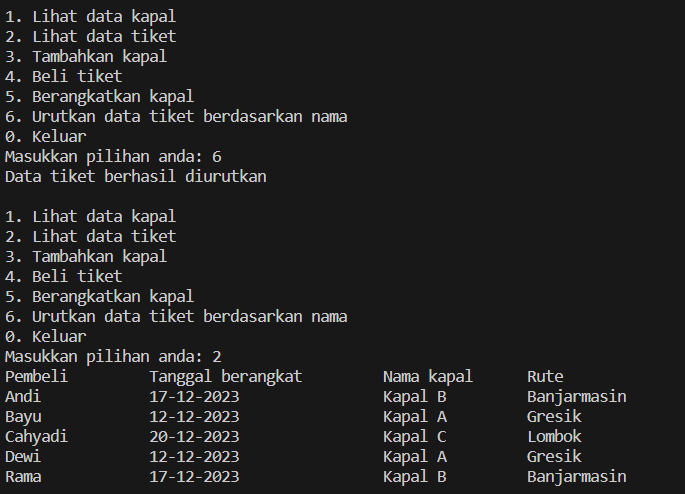

#### 5. Penutup

Kurang lebih seperti itu lah dokumentasi kecil dari program yang kami buat dengan sepenuh hati, jika terdapat kode yang redundant atau kurang efisien kami mohon maaf karena kami masih belajar.
